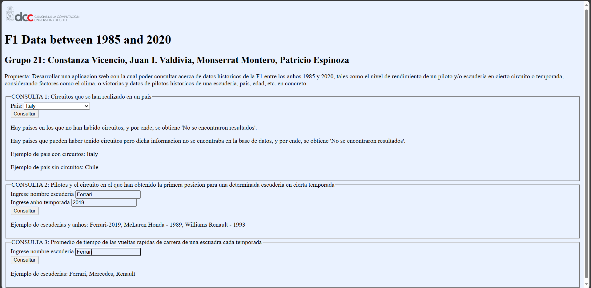
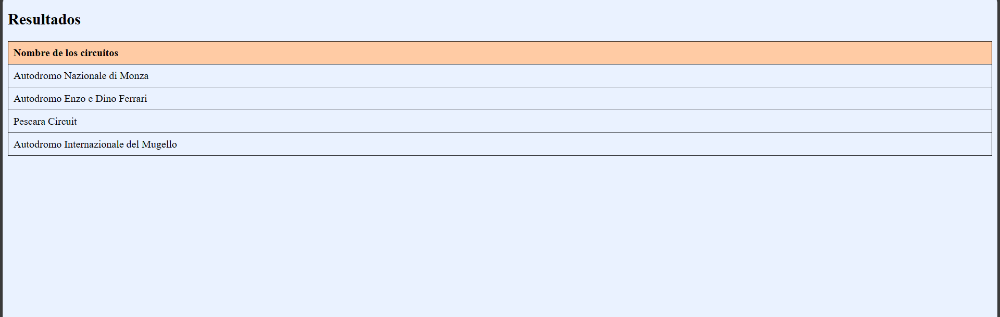
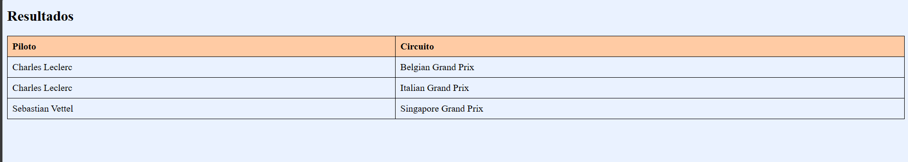
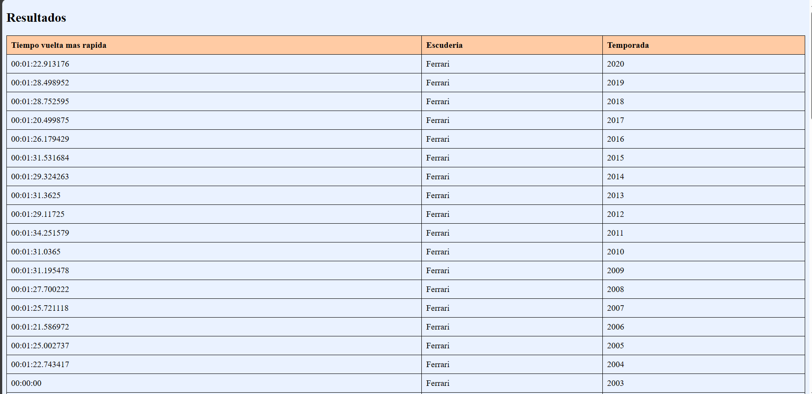

# CC3201-Proyecto-F1-Data-Between-1985-and-2020

# Introducción

La motivación principal de este proyecto fue resolver la problemática que enfrentan tanto los nuevos aficionados como los veteranos de la Fórmula 1, quienes a menudo desconocen datos históricos cruciales, como el rendimiento de los pilotos bajo circunstancias específicas o su historial de victorias. Esta falta de información puede dificultar la evaluación de las probabilidades de éxito de un piloto en una carrera. Para abordar esta necesidad, desarrollamos una aplicación web que permite consultar datos históricos de la Fórmula 1 entre los años 1985 y 2020. La aplicación ofrece información detallada sobre el rendimiento de pilotos y escuderías en diferentes circuitos y temporadas, considerando factores como el clima y las victorias, así como datos específicos sobre pilotos históricos, escuderías, países y edades. La base de datos utilizada para esta aplicación fue compilada y formateada por nosotros a partir de múltiples fuentes, garantizando así la precisión y la relevancia de la información proporcionada. En conclusión, nuestra aplicación está diseñada para permitir a los usuarios realizar un análisis más profundo y fundamentado del rendimiento histórico en la Fórmula 1.

El proyecto utiliza las siguientes bases de datos:
- https://www.kaggle.com/datasets/petalme/f1-drivers-dataset
- https://www.kaggle.com/datasets/jtrotman/formula-1-race-events
- https://www.kaggle.com/datasets/aadiltajani/fia-f1-19502019-data
- https://www.kaggle.com/datasets/prajwalsood/f1-race-by-race-19832021

# Página Web

A continuación se presenta la página web construida utilizando la base de datos trabajada durante el proyecto. Esta consta de tres consultas principales.

## Intefaz principal

## Resultados de las Consultas

### Primera Consulta:

### Segunda Consulta:

### Tercera Consulta:

## Integrantes:
- Juan I. Valdivia
- Constanza Vicencio
- Monserrat Montero
- Patricio Espinoza

## Profesor:
- Matías Toro

## Auxiliares:
- Claudio Gutiérrez
- Cristián Salazar
- Daniel Radrigán
- Fran A. Zautzik
- Scarlett Plaza

## Ayudantes:
- Daniela Assael
- Diego Reyes
- Joel Riquelme
- Kathleen Kohler
- Nahuel Gómez
- Natalia Quinteros
- Paula Ovalle
- Sebastián Contreras

## Fecha de entrega:
- 4 de Diciembre del 2023

## Ubicación:
- Santiago, Chile
